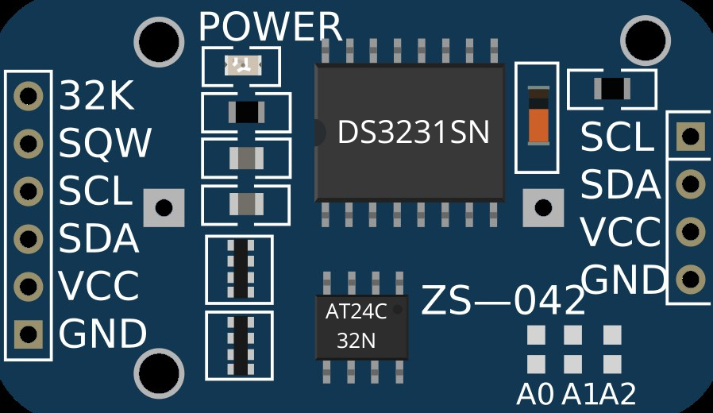

# Protocolos de Comunicación de Sistemas Embebidos - Práctica 1

## Objetivo:
Implementar un módulo de software que permita la comunicación con un circuito integrado (CI) utilizando los protocolos I2C o SPI.

## Dispositivo seleccionado

Para esta práctica se eligió el `RTC DS3231`, un reloj de tiempo real que utiliza el protocolo I2C.

<p align="center">
  
</p>

Este dispositivo permite llevar un registro preciso de fecha y hora, incluso durante cortes de energía.

### Características:

- Comunicación mediante I2C `(dirección por defecto: 0x68)`.

- Oscilador de señal cuadrada configurable.

- Salida de señal de 32 kHz.

- Medición de temperatura interna del CI.

- Alarmas (no utilizadas en este desarrollo).

## 📂 Organización del Repositorio

<pre> ``` 
📁 RTC_DS3231
├── 📁 Core
├── 📁 Debug
├── 📁 Devices
│   └── 📁 API
│       ├── 📁 Inc
│       │   ├── ds3231_port.h
│       │   ├── ds3231_registers.h
│       │   └── ds3231.h
│       │
│       └── 📁 Src
│           ├── ds3231_port.c
│           └── ds3231.c
│
├── 📁 docs (Doxygen)
│   └── 📁 html
│       └── index.html
│
├── 📁 Drivers
│   └── 📁 API
│       ├── 📁 Inc
│       │   └── dev_i2cm.h
│       │
│       └── 📁 Src
│           └── dev_i2cm.c
│
├── .gitignore
└── README.md
  
  ``` </pre>

## Documentación

La documentación del driver que se encuentra en este proyecto, la cual fué generada con **Doxygen**, se encuentra disponible en el siguiente enlace:

- [Ver documentación](docs/html/index.html)